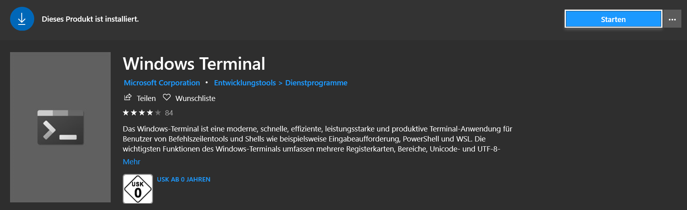
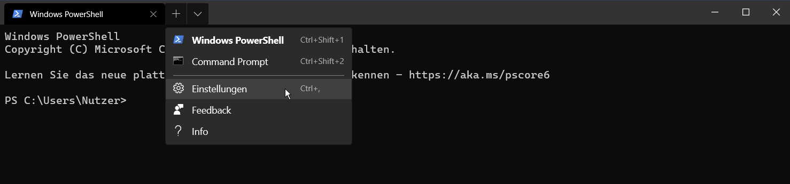

# New Windows Terminal

### Open Settings

Open the Windows Store and search for *Windows Terminal*, than install it!



On default a new terminal window with power shell as default terminal will start up.

Hit the drop down button and navigate to *Preferences*.



### Add GitBash Path

Under "profiles", "defaults", "list" add custom snippet below:

```json
{
	 "guid": "{abc00000-0000-0000-0000-000000000000}",
	 "name": "Git-Bash",
	 "commandline": "%PROGRAMFILES%\\Git\\bin\\bash.exe",
	 "icon": "%PROGRAMFILES%\\Git\\mingw64\\share\\git\\git-for-windows.ico",
	 "startingDirectory" : "~"
},
```

### Set GitBash as Default Terminal

Copy "guid" code and paste it into "defaultProfile".

```json
{
    "$schema": "https://aka.ms/terminal-profiles-schema",

    "defaultProfile": "{abc00000-0000-0000-0000-000000000000}",

    ...
    
}
```

You can also just copy the whole settings.json file and replace with your local settings.